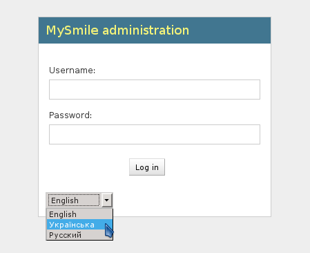
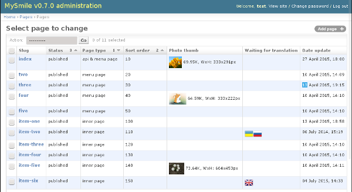
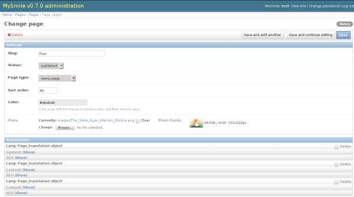
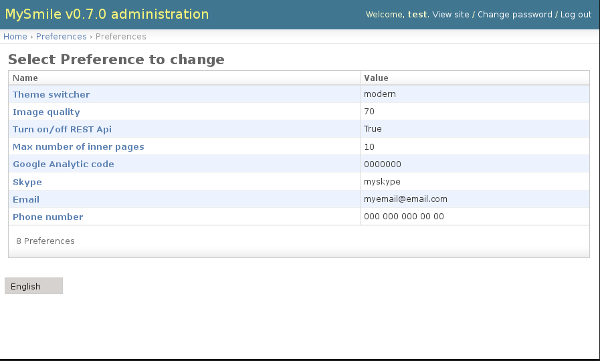

.. _AdminPanel:

Admin panel
===========

Multilingual [#f1]_ admin panel is available http://127.0.0.1:8000/admin/

  * Username: *test*
  * Password: *test*

.. rubric:: Footnotes
.. [#f1] Add another language can be a standard Django option **LANGUAGES** in *mysmile/settings/base.py* 

   