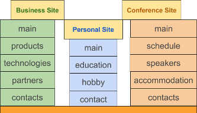

Objective
=========

MySmile is the lightweight open-source CMS based on Django. Project focus on context, usability and SEO. It is aimed particularly to small site that provides information about person or business. It is something similar to Blog and Homepage. Information of such site does not change so often as in Blog but more then on Homepage. In other side MySmile can be extended for the way as you want.

MySmile includes:
  * Admin panel for content managing
  * SEO: friendly url, meta, HTML5 semantic, Google analytics, etc
  * Flexible design configuration

Example of site structures that MySmile will be a best choose:
  * Small business site with pages: "Main", "Products", "Technologies", "Partners", "Contacts".
  * Personal site with pages: "Main", "Education", "Hobbies", "Contacts".
  * Conference site with pages: "Main", "Schedule", "Speakers", "Accommodation", "Contacts".
  * Quick start of Python and Django.

