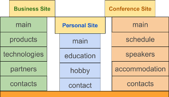

Objective
=========

MySmile is the lightweight open-source CMS based on Django. The project is focused on context, usability and SEO.
It is addressed particularly to small sites that provides information about a person or business.
It is somewhat similar to a Blog and Homepage. Information of such a site does not change so often as in case of a Blog but more often then on a Homepage.

MySmile includes the following:
  * Admin panel for content managing
  * SEO: friendly url, meta, HTML5 semantic, Google analytics, etc
  * Flexible design configuration

Examples of site structures for which MySmile will be the best choice are as follows:
  * Small business site with pages: "Main", "Products", "Technologies", "Partners", "Contacts".
  * Personal site with pages: "Main", "Education", "Hobbies", "Contacts".
  * Conference site with pages: "Main", "Schedule", "Speakers", "Accommodation", "Contacts".
  * Quick start of Python and Django.

