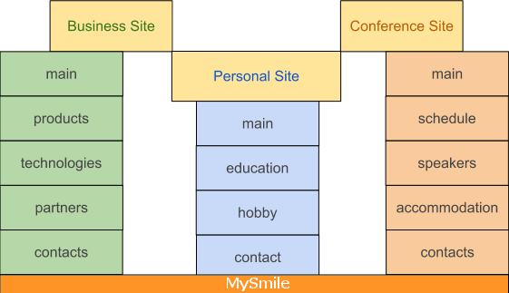

Objective
=========

Small site that provide information about one person or small business. It is something similar with 
Blog and Homepage. But comparing with Blog and Homepage it provides more simple structure. 
Information in this site does not change so often as in Blog but more often then on Homepage. 

What are the reasons for this site? Simple skeleton for sites like that:

* Small business site with pages: "Main", "Products", "Technologies", "Partners", "Contacts".
* Personal site with pages: "Main", "Education", "Hobbies", "Contacts".
* Conference site with pages: "Main", "Schedule", "Speakers", "Accommodation", "Contacts".
* Sites that focus on context, usability and SEO not on a  design.

After analyzed all projects that we work with we provide general structure of material and pages is 
depicted in the diagram.

